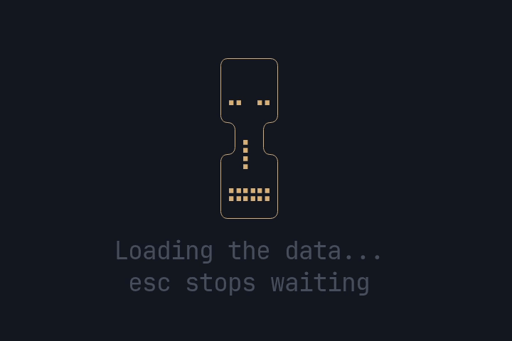

<p align="center"></p>

# pito-hourglass

[](https://github.com/gmrdad82/pito-hourglass/actions/workflows/ci.yml)
[](https://github.com/gmrdad82/pito-hourglass/tags)

An hourglass for ratatui apps to show while data loads: HEY's 13-frame Braille
hourglass, its copy (the label) under it, and an optional hint under that.
It's a ratatui 0.30 widget with no backend feature, so it sits beside
whatever crossterm the app already uses. It's part of
[PITO](https://pitomd.com).

## Install

It isn't on crates.io; add it to the app's `[dependencies]` from this
repository, pinned to a release tag:

```toml
pito-hourglass = { git = "https://github.com/gmrdad82/pito-hourglass", tag = "v0.1.3" }
```

## The behaviour

- **Always the hourglass plus the copy.** When the area is at least 11
  cells wide and 6 + 1 + hint rows high (7 without a hint, 8 with one), the
  glass, the label under it and the hint under that are centred as one
  block.
- **The copy always shimmers** in the app's accent: a three-character band
  sweeps across the label and pauses. The band's centre character is the
  accent plus bold, its two neighbours are the accent, every other
  character is muted. The band counts the characters actually drawn, so a
  truncated label still shimmers end to end.
- **When the space can't fit everything,** the glass goes and the
  shimmering label stays, centred, with the hint on the next row only when
  there's a second row. With no room for even the label (a zero width or
  height), nothing is drawn.
- **The hint never shimmers;** it's always muted.
- **Long copy is cut at a character,** never mid-glyph: widths come from
  Unicode (a CJK glyph is two cells, a combining mark rides with its
  letter), so Romanian diacritics, "…" and wide glyphs all cut cleanly.

## The timing

Both clocks run on the elapsed time alone, so a redraw at any moment lands
on the same picture.

```text
frame_at(elapsed)   e = elapsed mod CYCLE (4200 ms)
                    e <  3000: frame = floor(e * 7 / 3000)            the 7 drain frames, ~430 ms each
                    e >= 3000: frame = 7 + floor((e - 3000) * 6 / 1200)  the 6 flip frames, 200 ms each

band_at(elapsed, n) t = elapsed mod 1500 ms
                    t <  1200: centre = floor(t * (n + 4) / 1200) - 2
                    t >= 1200: None, the pause
```

`band_at` returns the centre's index into the `n` characters of the label,
and `None` whenever the centre is off the label (below 0, or at `n` or
beyond) and through the pause. The sweep starts two characters before the
label and ends two after it, so the band slides in and out: while the
centre sits just off either end, its neighbour on the label still lights.

## The API

```text
pub const WIDTH: u16;                    // 11, every frame's width
pub const GLASS_ROWS: u16;               // 6, every frame's height
pub const FRAMES: [[&str; 6]; 13];       // HEY's frames, verbatim
pub const CYCLE: Duration;               // one full turn, drain plus flip: 4.2 s
pub fn frame_at(elapsed: Duration) -> usize;
pub fn band_at(elapsed: Duration, n: usize) -> Option<usize>;

pub struct Hourglass<'a>;                // Widget, by value and by reference
impl<'a> Hourglass<'a> {
    pub fn new(elapsed: Duration) -> Self;
    pub fn label(self, label: &'a str) -> Self;        // the copy, "Loading..." until set
    pub fn hint(self, hint: Option<&'a str>) -> Self;  // e.g. Some("esc stops waiting")
    pub fn glass(self, style: Style) -> Self;          // the glass, per state if the app likes
    pub fn accent(self, style: Style) -> Self;         // the shimmer, the TUI's accent
    pub fn muted(self, style: Style) -> Self;          // the label's base and the hint
}
```

Each app passes its own copy and its own accent; the styles default to
`Style::new()`. The centre of the band adds bold to the accent style it's
given, and the neighbours use it as is.

## Example

```rust,standalone_crate
use std::time::Instant;

use pito_hourglass::Hourglass;
use ratatui::{
    Frame,
    style::{Color, Modifier, Style},
};

fn draw(frame: &mut Frame, started: Instant) {
    let hourglass = Hourglass::new(started.elapsed())
        .label("Loading the data...")
        .hint(Some("esc stops waiting"))
        .glass(Style::new().fg(Color::Yellow))
        .accent(Style::new().fg(Color::Magenta))
        .muted(Style::new().fg(Color::DarkGray).add_modifier(Modifier::DIM));
    frame.render_widget(hourglass, frame.area());
}
```

Redraw about every 50 ms while it shows; the picture depends only on the
elapsed time.

The same code runs in a terminal as [examples/demo.rs](examples/demo.rs), the
clip at the top of this page; Esc or q quits:

```sh
cargo run --example demo
```

## Development

`bin/gate` runs `cargo fmt --check`, `cargo clippy --all-targets -- -D
warnings`, the tests with `cargo nextest run` and the doctests with `cargo
test --doc` (the tests render through ratatui's `TestBackend`, a counting
allocator holds that drawing allocates nothing, and this README's example
compiles as a doctest). Nothing in it is slow, so `bin/gate --fast` is the
same gate, and CI runs it on every push and pull request to main.

## Contributing

Issues and pull requests are welcome. Please read the
[code of conduct](CODE_OF_CONDUCT.md) first. A change keeps `bin/gate` green
with no warnings, draws without allocating, keeps the picture a function of
the elapsed time alone, and leaves every word and style to the app. Report a
security issue privately, as [SECURITY.md](SECURITY.md) says, not in a public
issue.

## Licence

The code is MIT licensed, by Catalin Ilinca: see [LICENSE](LICENSE). The
PITO name and its logos are © Catalin Ilinca, all rights reserved, and are
not covered by the MIT licence; see [TRADEMARKS.md](TRADEMARKS.md). The clip
at the top is under the MIT licence like the code
([docs/demo.gif.license](docs/demo.gif.license)). The hourglass frames and
their timing come from [basecamp/hey-cli](https://github.com/basecamp/hey-cli)
under its MIT licence; see [NOTICE.md](NOTICE.md).
